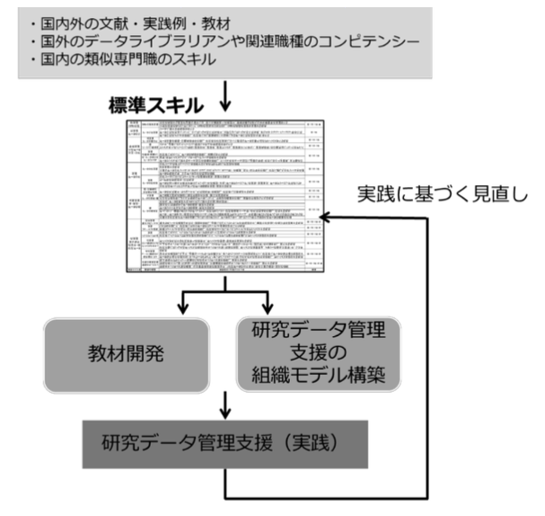
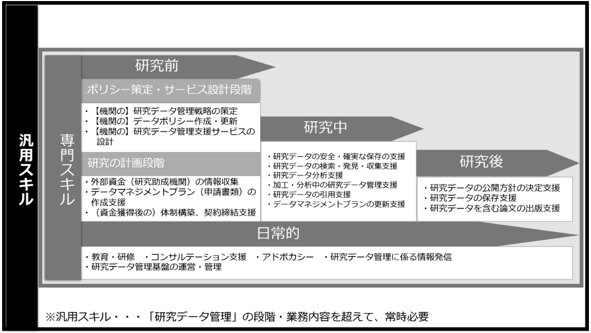

# 研究データ管理支援人材に求められる 標準スキル(ver.0.1)【解説】

## 1.日本国内での「研究データ管理」をとりまく状況

　研究データ管理(Research Data Management)とは、“ある研究プロジェクトにおいて使用された、あるいは生成されたデータの組織化、構造化、保存、共有、公開、再利用に関する一連の作業”1)を指す言葉です。日本国内では、組織的な「研究公正の強化」と「オープンサイエンスへの対応」という2つの側面で注目を集めています。政策的にも、内閣府の『我が国におけるオープンサイエンス推進のあり方について(2015)』2)、『第 5 期科学技術基本計画(2016)』3)、文部科学省による『学術情報のオープン化の推進について(審議まとめ)(2016)』4)、日本学術会議の提言『オープンサイエンスの深化と推進に向けて(2020)』5)等、関連する政策文書が次々と公表されてきました。とりわけ、2020 年 6 月に発表された『統合イノベーション戦略(2020)』6)において、研究データ管理は喫緊の課題として大きく取り上げられています。
　こうした政策動向を受け、国内の研究助成機関、AMED、JST、経済産業省などは、既に研究データの管理に関する方針を策定し、採択課題の研究代表者に対して「研究データ管理計画書(Research Data Management Plan)」の提出を義務化しています。日本学術振興会も「科学研究費助成事業」への応募時 に、研究データ管理計画書の要求を検討しはじめており、2020 年度募集分からは特定の研究種目、新学 術領域研究(研究領域提案型)等において、既にその動きがみられています。7)
　さらに本年 2021 年 6 月には、内閣府『統合イノベーション戦略(2021)』 において「公的資金による研究データの管理・利活用に関する基本的な考え方」が示され、1研究データ基盤システムを中核的なプラットフォームとして位置付け、メタデータ検索可能な体制を 2023 年度までに構築すること、2各研究開発機関がデータポリシーを策定し、機関リポジトリへの研究データの収載を進めること(※機関 リポジトリを有する全ての大学・大学共同利用機関法人・国立研究開発法人は、2025 年までにデータポリシーを策定すること)、3公募型研究資金の全ての新規公募分について、メタデータを付与する仕組みを 2023 年度までに導入することなど、より具体的な内容と目途に踏み込んだ基本方針が既に示されています。

## 2.組織的な「研究データ管理」と「支援人材」の必要性

研究データ管理に関して、日本国内では研究公正の強化、特に、リスクマネジメントとしての「研究データ保存」の側面から注目されがちです。しかしながら、研究データ管理は「データ保存」のみならず、研究計画書の作成からデータの再利用に至るまで、研究の全プロセスに関わる課題です。これまで、 各機関で研究支援を担当してきた関連部署(例:研究推進・産官学連携・知財・法務・図書館)と、そこに属する支援人材にとっては、今後、何らかのかたちで関わりが生じてくる課題といえます。
さらに、学術研究とはそもそも一機関で完結せず、国境を超えて行われ、その成果が時代を超えて共有・利用される行為です。2013 年の G8科学大臣会合における『研究データのオープン化を確約する8)共同声明』でも明示されているとおり、今日の学術研究において、根拠となる研究データの“公開性”を確保することは、研究の透明性・一貫性・整合性と深く関与する問題であると同時に、学術研究の進 展自体に欠かせない国際標準(グローバル・スタンダード)でもあります。
実際に、国際的な学術雑誌では、論文投稿時にデータの公開や共有(デポジット先の明示)を求めるガイドラインやポリシーを整備しつつあります。2020 年 4 月に Elsevier 社の学術雑誌(アクティブかつ Science Direct で閲覧可能な雑誌)約 2,600 誌を対象に実施した調査では、著者向けガイドラインにおいて研究データの共有を「推奨」しているジャーナルは全体の 63%、「必須」としているジャーナ ルは3%となっており 9)、今後は、さらにデータの共有を「必須」とするジャーナルの増加も予想されます。
研究データ管理は、まずは研究に直接従事する研究者自身が原則行うべきものです。しかしながら、その範囲はデータの生成から再利用まで広範囲に及び、管理に必要な知識やスキルも膨大です。ある研究分野の専門家といえども、研究者自身が、研究データの管理に必要な知識やスキルを(最新動向も含めて)網羅的に習得するのは困難です。実際、Springer Nature 社が 2018 年に公表したレポート(世界10)中の 7,700 名の研究者を対象に行った意識調査) では、多くの研究者がデータを適切に管理して共有することは大事だと答えた一方で、

* 利用可能な形でデータを整理するのが大変だ
* 著作権やライセンスのことがよくわからない
* 利用できるリポジトリがどこにあるのかわからない
* 時間がない
 
 といったさまざまな課題を指摘しています。 研究データの管理・共有・公開を実践する上では、上記のような、研究者がその過程で直面する様々な課題や障壁を乗り越えていくための各種支援と、支援を担う人材が必須といえます。国際的な研究力強化や、学術情報の利活用(流通促進)が求められる現在、大学をはじめとする各研究機関は、研究に関連する部署と人材(例:技術職員、URA、大学図書館職員等)がスクラムを組み、「組織的に」研究を支えてゆくことが必要です。政策的にも研究データ管理に関しては、組織的に支援するための連携体制の整備と、人材の育成が不可欠とされています 11)。
こうした背景を受けて、オープンサイエンス作業部会トレーニング・サブ・ワーキング・グループ(トレーニング SWG)では、研究データ管理の支援人材に求められる標準スキルの策定に着手しました。

## 3.「標準スキル」の策定目的と策定方法

(1) 標準スキルの定義
本表における「標準スキル」とは、(3)標準スキルの策定方法に述べる手順を経て、既存の教材・事例・文献から同定した、「研究データ管理の支援業務を遂行するにあたって、研究分野を問わずに求められる、知識・技術(スキル)・能力・行動特性(コンピテンシー)」を指します。
本表では、研究データ管理の支援に関わる「業務」をフレームワークとして、すべての要素を整理しています。「業務」の遂行時には、スキルやコンピテンシーは渾然一体で不可分であることから、本表では 両者を厳密に区別せず、以下「標準スキル」と総称で呼んでいきます。また、本表には特定の研究分野で必要とされる、分野特化型のスキルやコンピテンシーは含めていません。

(2) 標準スキルの策定目的
研究データ管理支援人材に求められる標準スキル(ver.0.1)の策定目的は「一覧表の提示」そのものではなく、まずは、各研究機関において「研究データ管理業務」を実践する過程で、次の2点でこの「標準スキル」を活用することにあります。
i.支援人材を育成するための教材やプログラムの開発・評価 
ii.各機関の状況に合わせた「組織的な支援・連携体制」の構築
(例:1自機関に必要な支援機能や人材の確認、2連携すべき部署やステークホルダーの検討等)

さらに、こうした各組織における取組(実践)の結果を通じて、今回提示した「標準スキル」が、将来的に更新・進展されていくことを企図しています。本表を「完成版」として享受するのではなく、各組織の支援人材各々が「現場で一覧表をさらに育てていく」こと自体が最終目的です(図1)。

 図1:研究データ管理支援人材に求められる標準スキルの改善モデル

(3) 標準スキルの策定手法(スキルの同定)
標準スキル作成の手法として、一般的には、文献調査、業務の分析、需要の把握、という3つの作業がとられています。しかしながら、現状、ごく一部を除き、国内の研究機関において機関レベルでの「研究データ管理に関する支援業務」は、ほぼ実施されておらず、実践に基づいた業務の分析や需要の把握は困難です。そこで今回は、

【A】 国内外の、既存の研究データ管理支援者向け教材

【B】 国外の、実践事例の確認(英国のエディンバラ大学やオランダのワーゲニンゲン大学等のウェブページ)

【C】 国外の、データライブラリアンや関連職種のコンピテンシーに関する文献

【D】 国内の、類似専門職のスキル標準に関する文献

上記 A・B の構造分析によって「支援業務の段階」を明らかにし、さらに、上記 A・B・C の内容分析によって「支援業務の内容と詳細」を明らかにしました。そのうえで、A・C・D を対象に「支援人材に必要と考えられるスキルとコンピテンシー」を抽出・同定し、その結果を一覧表に整理して示しています (※分析に使用した「主要参考文献」は末尾参照)。

(4) 標準スキル一覧の構造と見方

「汎用スキル」と「専門スキル」
標準スキル一覧では、こうして見出した標準スキルを「汎用スキル」と「専門スキル」の2つに区分しました。「汎用スキル」は、研究データ管理の支援段階や業務内容を超えて、“常に” 必要となる、基本的なスキルとコンピテンシーを中心に構成されています。「専門スキル」は、研究データ管理の支援業務を遂行する「各段階」と「各業務」に応じて、個別に必要となる専門的なスキルやコンピテンシーで構成されています。図2は、標準スキル一覧における見出し、特に「汎用スキル」と「専門スキル」の関係性を俯瞰するために示したものです。「汎用スキル」は「専門スキル」の基盤となるため、業務の段階や 内容に関わらず、支援者があらかじめ習得しておく(習得するように努める)ことが望ましいといえます。

図2:汎用スキルと専門スキルの関係性(支援段階と支援業務)

「専門スキル」と「研究の段階」
「専門スキル」は、1研究の各段階(研究前・研究中・研究後)で生じる業務と、2研究の全段階で日常的に行われる支援業務の2区分に整理されています。このうち、1の研究前については、さらに、主に機関レベルでの意思決定を支援する「ポリシー策定・サービス設計段階」と、主に研究プロジェクトを支援する「研究の計画段階」に分けました。そのうえで、各「業務内容」ごとに、必要なスキルとコンピテンシーを整理して示しています。 ここで示した各段階は、「研究データ管理の支援」を遂行する上で、いつ・どのようなスキルやコンピテンシーが必要なのかを、支援者がチェックするための、あくまで目安にすぎません。特に、研究の 段階については、研究領域や研究対象によって大きく異なるため、本表での分類内容が、必ずしも「実際の研究段階」とは合致していない点に、留意する必要があります。

「業務の概要」と「業務の詳細」
「業務の概要」は、「研究データ管理の支援」を遂行するために必要な個別の業務を、体系的に把握するために設定した区分です。また「業務の詳細」は、その業務において個別に行われる、具体的な業務内容を詳細に述べたものです。教材において言及のあった、あるいは、文献内で実際に各専門職が遂行していた具体的な業務の内容や、提供すべき研究データ管理支援サービスの内容等を参照のうえ整理しました。

「業務を担いうる職種」
ここには、研究データ管理の支援業務を遂行するにあたり、当該業務を担いうる「可能性のある職 種」を広く例示しました。「標準スキル」における、各職種の説明は以下のとおりです。職種説明、担当業務、役割分担等は、実際には組織ごとに大きく異なるため、ここで示したものはあくまでも「標準スキル」における凡例にすぎません。各機関における類似した職種(近い部局や職種名)に置き換えたり、読み替えたりしながら参照してください。

表1:業務を担いうる職種の略称と説明

| 略称 | 職名（一例） | 説明 |
|----|----|----|
| 経営者 | 学長、理事、執行部、部局長 | 研究機関やその部門の長、理事として経営を担う責任者 |
| RDM | RDMコーディネーター （マネージャ） | 全学または研究プロジェクトのRDMに関わる業務（主に調整や統括的マネジメント）を専門的に行う担当者 |
| 図書 | 図書系事務職員 | 機関リポジトリなど成果発信に関わる業務の担当者 |
| IT | 情報基盤系技術教職員 | 情報基盤（インフラ・ネットワーク）に関わる業務を専門的に行う担当者 |
| URA | リサーチアドミニストレーター（URA） | 研究推進に関わる業務を専門的に行う担当者 |
| 研推 | 研究推進系事務職員 | 研究推進に関わる業務の担当者 |
| 教務 | 教務系事務職員 | 教務系のうち、学生の論文の受理に関わる業務の担当者 |
| IR | IR担当職員（IRer） | IR（機関研究）を専門的に行う担当者 |
| 産官学 | 産官学コーディネーター、産官学担当職員 | 産官学連携、社会連携に関わる業務を専門的に行う担当者 |
| 知財 | 知的財産担当職員 | 特許、研究成果（データベース含む）の著作権に関わる業務を専門的に行う担当者 |
| 契約 | 契約担当職員 | 共同研究時の契約を専門的に行う担当者 |
| 秘書 | 研究室秘書、事務補佐員 | 研究室等の事務全般の支援を担当する者 |
| 実験 | 実験・測定装置担当職員 | 特定の装置等による実験や測定を実施、支援を専門的に行う担当者 |
| DS | （データ解析・分析に関わる）専門職員・技術補佐員等 | データサイエンスの研究者（データサイエンティスト）、技術者（データエンジニア） |

## 4.「標準スキル一覧」の利活用:今後に向けて

最後に、本表の今回策定した「標準スキル一覧」は、1支援人材を育成するための教材やプログラム の開発・評価、2各機関の状況に合わせた「組織的な支援・連携体制」の構築への利活用を想定して作成しました。
研究データ管理の支援を遂行するにあたっては、1研究データ管理に特化したエキスパートの存在を新たに育成するという人材育成モデルや、2図書系職員・URA・技術系職員・研究推進系事務職員等、既に組織内で研究支援に関与している(もしくは今後しうる)多くの支援人材(部局・職種)と協働して「機関全体として」その機能を担うという組織モデルの実現も可能であると考えられます。

(1) 支援人材を育成するための教材やプログラムの開発・評価

「研究データ管理」のような、新しい領域の支援人材を育成しようと考えた場合、最初に必要となるのは、人材の教育プログラムや教材です。しかしながら「研究データ管理」に関しては、機関ごとに、おかれた状況や各種ポリシー(例:研究推進ポリシー、研究データ管理ポリシー、個人情報保護のポリシー等)が異なるうえ、さらに、なによりも研究領域ごとのディシプリンの違いや、研究者ごとに異なる研究行為の特性、データの性質などの影響を多大に受けます。したがって、支援人材の育成にあたっても、機関ごとに独自の教材開発を実施する、独自の研修プログラムを設けるなど、機関ごとのカスタマイズが必須となるでしょう。
こうした、新規の教材開発や、既存の教材のカスタマイズ、独自の研修プログラムの作成にあたって、各機関で「既存の教材にどのような項目を追加していくべきか」「自組織の支援人材にどのようなスキルを獲得するための研修を行うべきか」を知り、支援人材向けの教材や研修プログラムを開発・評価するときのひとつの「めやす」として、この「標準スキル一覧」を利活用していくことが可能です。

(2) 各機関の状況に合わせた「組織的な支援・連携体制」の構築
(必要な支援機能や人材の確認、連携すべき部署やステークホルダーの検討)

「研究データ管理」を各組織で実施する場合、人材育成と並行して課題となるのが、組織的な支援体制の構築や、連携体制の構築です。「標準スキル一覧」で示した通り、「研究データ管理」の支援は多段階かつ多岐にわたる業務であり、求められるスキルも非常に多様です。この場合、ある特定の部署がその全てを担うというのではなく、複数の部署が連携して、組織的に支援業務を担うのが適切かつ現実的と考えられます。実際、イギリスのデジタル・キュレーション・センターが 2014 年に実施した調査 12)によって、大学の規模により多少の差はあるものの、図書館、研究支援部門、IT 部門が相互に連携して、研究データ管理に取り組んでいるという実態が明らかになっています。
今回提示した「標準スキル一覧」には、こうした「組織的な支援・連携体制」の構築のヒントとして、必要なそれぞれの業務を担いうる候補人材もあわせて列挙しています。各組織に該当する関連部署や職種(人材)が既に存在する場合には、連携を模索するときの指針にしてください。一方で、もし、組織内に該当する部署や職種(人材)が存在しない場合には、既存の部署や人材の範囲内で「担いうる」部署や人材を探すことになります。その場合、必要な各業務に対して「既存のどの部署・どの職種が、どの程度担いうるか」を検討する必要が生じます。その際にもこの「標準スキル一覧」を一種のガイドとして用いることが可能と考えます。
一例として、提示した「標準スキル一覧」の「研究後」~「日常的支援」に含まれる業務とスキルを参照してみましょう(参照:スキル ID = S30130101 以降)。ここに含まれる支援業務は、学術情報資源を整理し、教育研究活動を支援するという点で、従来、図書館員が担ってきた業務と極めて親和性が高いことが分かります。組織内の「既存部署」として図書館がこうした業務を「担いうる」と判断できる場合や、組織内の「既存人材」として図書館員がこれに関連スキル(例:研究データの保存に関する知識、教育・研修、研究データの検索や収集に関する技能)を既に保有していた場合には、この部分の業務は、図書館(員)が担える可能性は高いと判断できます。支援業務の「どの部分を」「誰と組んで」「どのように進めるか」を試行錯誤する端緒として、本表を活用してください。

## 5.まとめ

オープンサイエンス作業部会トレーニング SWG では、研究データ管理支援人材に求められる「標準スキル」の策定に着手し、90 項目の「標準スキル」を同定・整理しました。「研究データ管理」の支援業務に関しては、研究者の研究活動を支えてきた既存職種(例:大学図書館員や URA)の既有スキルが、ある程度適用可能である一方、既存の知識や技能の範囲を超えた知識や技能が新たに必要な業務も、確かに存在します。「研究データ管理」に関しては、人材の再教育に加えて、他部署・多職種との連携が必須であり、大学等の組織においてサービスを実践するには、研究支援人材(例:図書館員、URA、情報センターの技術職員、データサイエンティスト等の研究支援職員)同士の協働が、今後、ますます不可欠であると考えられます。
今後は、研究者に対する需要調査や、実際に「研究データ管理」や周辺の研究支援業務を既に実施している支援人材の業務分析等を通じて、「標準スキル一覧」の精度を向上させ、将来的には、

* 「標準スキル」一覧に基づく人材育成のための教材作成やカスタマイズ、研究データ管理支援人材の育成
* 各組織における、状況や背景に合わせた「組織的な支援・連携体制」の構築 
* 各組織における、個別の研究データ管理の支援サービスの実践 
* その実践結果に基づいた、必要な「標準スキル」の見直し 
* それによる、より効率的な実践への発展(教材の評価・改善、組織モデルの修正等の実施)

といった、図1に示したような「循環」が生まれていけば、日本国内における「研究データ管理」全体にとって望ましいと考えます。この「標準スキル」一覧が、こうした循環の端緒となり、かつ、現場のみなさんの実践知をふまえたうえで、現実に即した研究支援へと繋がっていくことを願ってやみません。

国立情報学研究所 学術情報ネットワーク運営・連携本部 オープンサイエンス研究データ基盤作業部会 トレーニング・サブ・ワーキング・グループ 2020 年度 委員  
(主査)  
高久 雅生(筑波大学)  
(委員)  
天野 絵里子(京都大学)  
尾城 孝一(国立情報学研究所)   
國本 千裕(千葉大学)  
田中 幸恵(名古屋大学)  
古川 雅子(国立情報学研究所)   
山地 一禎(国立情報学研究所)  

【引用・注釈】
1) 尾城孝一. (2018). データライブラリアンの輪を拡げよう. https://rcos.nii.ac.jp/diary/2018/07/20180726-1/
2) 内閣府 国際的動向を踏まえたオープンサイエンスに関する検討会. (2015). 我が国におけるオー プンサイエンス推進のあり方について.
https://www8.cao.go.jp/cstp/sonota/openscience/
3) 内閣府. (2016). 第 5 期科学技術基本計画.
https://www8.cao.go.jp/cstp/kihonkeikaku/index5.html
4) 文部科学省 科学技術・学術審議会学術分科会学術情報委員会. (2016). 学術情報のオープン化の
推進について(審議まとめ). https://www.mext.go.jp/b_menu/shingi/gijyutu/gijyutu4/036/houkoku/1368803.htm
5) 日本学術会議. (2020). オープンサイエンスの深化と推進に向けて. http://www.scj.go.jp/ja/info/kohyo/kohyo-24-t291-1-abstract.html
6) 内閣府. (2020). 統合イノベーション戦略. https://www8.cao.go.jp/cstp/tougosenryaku/2020.html
7) 内閣府. (2021). 統合イノベーション戦略. https://www8.cao.go.jp/cstp/tougosenryaku/2021.html
8) G8 Science Ministers Statement London UK, 12 June 2013. (2013). Department for Business, Innovation & Skills, United Kingdom. https://www.gov.uk/government/publications/g8-science-ministers-statement-london-12- june-2013
9) 尾城孝一. (2020). オープンサイエンス推進のための研究データ管理講座の開発. 学術情報基盤 オープンフォーラム 2020. https://www.nii.ac.jp/openforum/2020/day1_os1.html
10) David, S., Grace, B., Iain, H., Katie, A., Dan, P., Mithu, L., & Mathias, A. (2018).
Whitepaper: Practical challenges for researchers in data sharing.
https://doi.org/10.6084/m9.figshare.5975011.v1
11) 文部科学省 科学技術・学術審議会学術分科会学術情報委員会. (2016). 学術情報のオープン化の
推進について(審議まとめ). https://www.mext.go.jp/b_menu/shingi/gijyutu/gijyutu4/036/houkoku/1368803.htm 実際、文部科学省の学術情報委員会による「学術情報のオープン化の推進について(審議まと め)」のなかでも、大学等に期待される役割のひとつとして、“技術職員、URA 及び大学図書館職 員等を中心としたデータ管理体制を構築し、研究者への支援に資する”ことが挙げられていま す。
12) Whyte, A., & Sisu, D. (2014). Results of the Digital Curation Centre 2014 RDM Survey- Briefing 1. Zenodo. doi:10.5281/zenodo.10711
